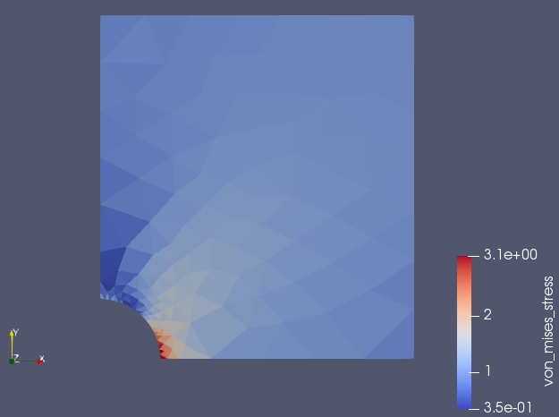

# minfem2d

Minimal 2D implementation of the finite element method.



Based on [this paper](https://habr.com/ru/post/271723/).

## Usage

Run the `main.py` with the input model to get results in VTK format:
```cmd
> python main.py workspace/test1.inp
```
